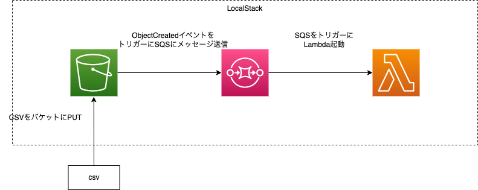

# localstack-s3-sqs-lambda

This is a sample repository to make an AWS based event driven architecture on a local docker container environment by using LocalStack.

## Architecture

The architecture, which consists of S3, SQS and Lambda, is as follows.
When a csv file is uploaded to S3, the event nortification is sent to SQS.
Then, the Lambda function is triggered by the SQS event.

